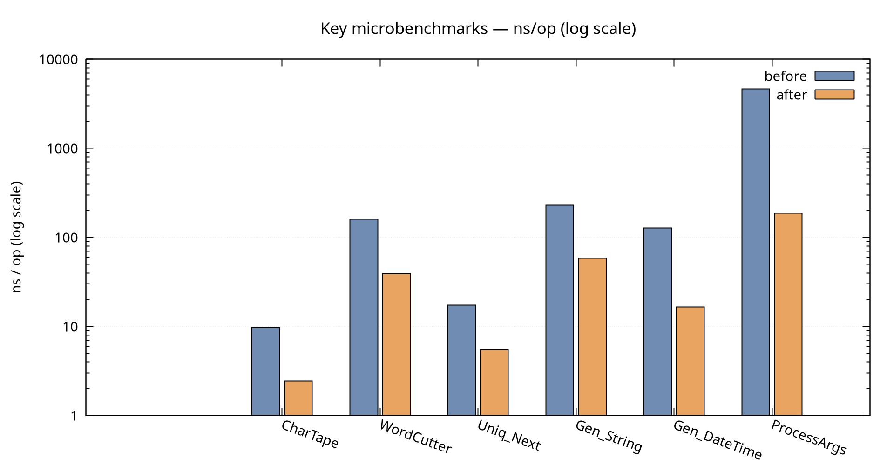
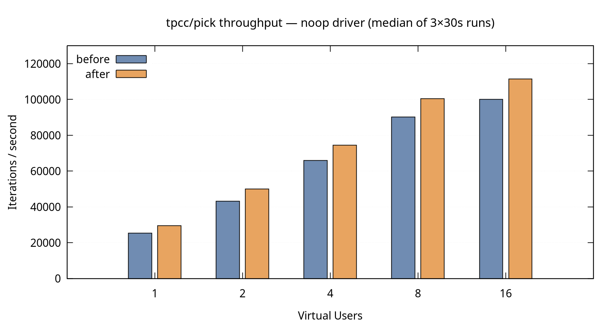
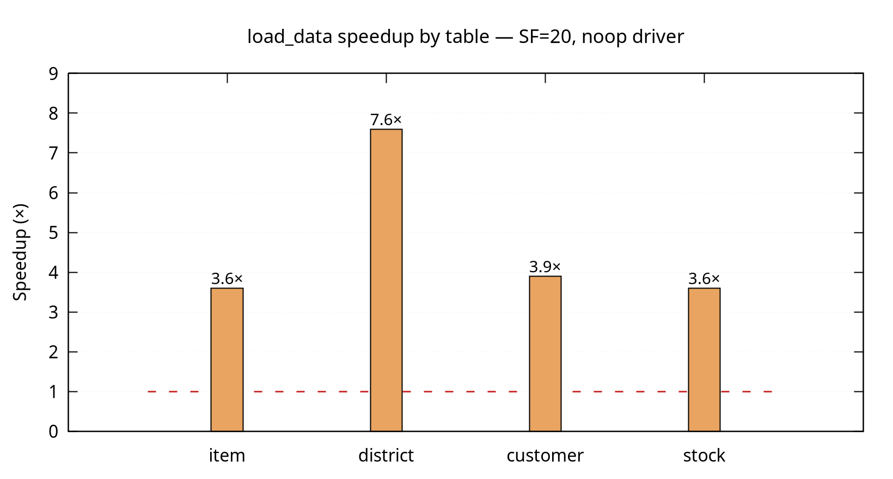

The [previous post](/blog/measuring-stroppy-before-measuring-databases) ended with a ceiling: 100 000 iterations per second through the noop driver. That raised an obvious question — was that any good? We built the noop driver to measure stroppy, not a database. So what is stroppy doing with its time when there is no database? We pulled a pprof profile to find out. This post covers what the profiles showed and what we changed.

The short answer: stroppy's Go generator pipeline had a handful of avoidable allocations and one surprisingly expensive hot path. Fixing them took a full PR. The end-to-end throughput improvement is moderate — about 11–16% on a steady-state workload. The data generation speedup is more dramatic: 3.7× across the board. Neither number is astonishing, but the work was worth doing and some of the details were interesting.

<!-- truncate -->

## What pprof Showed

To profile, we run stroppy with `--profiling-enabled` and pull a profile against the built-in pprof endpoint:

```bash
stroppy run tpcc/pick -d noop -- --vus 8 --duration 10m --profiling-enabled
# in another terminal:
go tool pprof -http=:8080 http://localhost:6565/debug/pprof/profile?seconds=30
```

Three things stood out in the CPU and heap profiles:

1. **`WordCutter.Cut`** — every generated string copied its buffer via `strings.Builder.String()`. One 16-byte heap allocation per string field, per row, everywhere.
2. **`ProcessArgs`** — the function that rewrites named SQL placeholders (`:w_id` → `$1`) ran a regex scan and `strings.Builder` assembly on every single query execution. SQL templates don't change between calls, but nothing was cached.
3. **`*stroppy.Value` boxing** — every generated value was wrapped in a protobuf oneof struct before being handed to the driver. One allocation per value, regardless of type.

These three accounted for most of the non-sobek heap activity.

## The Fixes

### String generation

The `strings.Builder` approach in `WordCutter` accumulates characters into a buffer and then calls `.String()` to return a copy. The copy is unnecessary — the caller only needs the string long enough to pass it to the driver, and the buffer will be reset immediately after.

The fix: replace `.String()` with `unsafe.String(unsafe.SliceData(buf), len(buf))`. This returns a string header that aliases the internal buffer directly. No allocation. The lifetime contract is the same as before — valid until the next `Cut()` call — which the caller already respected.

We also rewrote the character tape. The original picked a random Unicode range, then called `IntN` twice per character. The new version caches one `uint64` from the PRNG and extracts `log2(alphabetSize)` bits per character with a bitmask. For a 52-character alphabet (A-Z, a-z), that's one PRNG call per ~10 characters instead of two per character. The lookup table is sized to the next power of two for cheap masking.

Combined: `WordCutter.Cut` went from 161 ns / 1 alloc to 39 ns / 0 allocs.

### SQL template caching

`ProcessArgs` was doing real work on every call: a regex scan to find `:param` tokens, and a `strings.Builder` pass to rebuild the SQL with positional placeholders. All of this is determined by the SQL template and the dialect — it doesn't depend on the argument values at all.

The fix is a `sync.Map` keyed by `dialect.Placeholder(0) + "|" + sqlStr`. The first call for each `(dialect, sql)` pair parses and stores a `parsedQuery` struct. Every subsequent call does a map lookup and fills the argument slice. The cache is capped at 1 000 entries.

Result: 4 636 ns / 13 allocs → 186 ns / 2 allocs. The 96% reduction is large because the cached path is almost nothing — one map lookup, one slice fill.

### `*stroppy.Value` boxing

The generator interface previously returned `(*stroppy.Value, error)`, where `*stroppy.Value` is a protobuf oneof that wraps the actual value. Every call to `Next()` allocated a new wrapper struct.

We changed `Next()` to return `(any, error)` with native Go types: `int64`, `float64`, `uuid.UUID`, `time.Time`, `decimal.Decimal`, `*string`. Types narrower than 64 bits are widened so they fit in the interface word without a `convT` allocation.

For types that still heap-allocate (time.Time, decimal.Decimal), we use a "slotted" generator: the generator owns a single value slot in a closure and returns `*T`. A pointer is always pointer-sized, so boxing it as `any` is zero-alloc. The caller must not hold the pointer past the next `Next()` call — the same constraint as `WordCutter.Cut`.

Result: integer and string generators dropped to zero allocations per call. DateTime: 127 ns / 4 allocs → 17 ns / 0 allocs.

### Smaller fixes

A few smaller wins rounded out the PR:

- **`UniqueDistribution`**: replaced `atomic.Pointer[T]` (allocates a new value on every CAS) with `atomic.Uint64` (plain counter). −68%, 1 alloc → 0.
- **`UniformDistribution` integer path**: was using `Float64()` + `math.Round()` for integer ranges. Replaced with `Uint64N(span+1)`. −43%.
- **`TupleGenerator`**: replaced a goroutine + buffered channel with an inline depth-first state machine.
- **genIDs**: `QueryBuilder` now precomputes generated ID lists at construction, not per batch.

## The Numbers

### Microbenchmarks

Running `go test -bench=. -benchmem -count=10` before and after, with `benchstat` for comparison:



| Benchmark | Before | After | Δ |
|-----------|-------:|------:|---|
| `CharTape_Next` | 9.7 ns | 2.4 ns | −75% |
| `WordCutter_Cut` | 161 ns / 1 alloc | 39 ns / **0** | −76% |
| `StringGenerator_Next` | 169 ns / 1 alloc | 40 ns / **0** | −76% |
| `UniqueNumber_Next` | 17.4 ns / 1 alloc | 5.5 ns / **0** | −68% |
| `Generator_String` | 232 ns / 2 allocs | 58 ns / **0** | −75% |
| `Generator_DateTime` | 127 ns / 4 allocs | 17 ns / **0** | −87% |
| `Generator_Decimal` | 349 ns / 9 allocs | 116 ns / 1 | −67% |
| `ProcessArgs` | 4 636 ns / 13 allocs | 186 ns / 2 | **−96%** |

The log scale on the chart is needed because `ProcessArgs` (4 636 ns → 186 ns) and `CharTape_Next` (9.7 ns → 2.4 ns) live in completely different ranges.

### End-to-end throughput

The `tpcc/pick` workload against the noop driver, varying VU count. Each data point is the median of three 30-second runs.



| VUS | Before | After | Δ |
|----:|-------:|------:|---|
| 1 | 25 424/s | 29 421/s | +15.7% |
| 2 | 43 175/s | 50 072/s | +16.0% |
| 4 | 65 919/s | 74 566/s | +13.1% |
| 8 | 90 264/s | 100 419/s | +11.2% |
| 16 | 100 170/s | 111 489/s | +11.3% |

The gain is uniform across VU counts, which confirms it's per-operation work, not something contention-related. The scaling curve itself doesn't change — both versions plateau at the same point, limited by the sobek event loop scheduler, not the generators.

Against **pg-noop** (real TCP, full PostgreSQL wire protocol on localhost) the gain is +11.5% at VUS=1, +8.8% at VUS=8. Smaller, because the ~51 µs protocol overhead per transaction dilutes the per-operation generator savings.

### Data generation

The most visible improvement is in `load_data` — the phase that generates and inserts all TPC-C tables before the workload starts. This runs entirely in Go with no JS overhead per row, so it directly measures generation throughput.



| Scale factor | Rows | Before | After | Speedup |
|-------------:|-----:|-------:|------:|--------:|
| 1 | 231K | 1.20s | 0.32s | 3.8× |
| 20 | 2.7M | 20.2s | 5.5s | 3.7× |
| 100 | 13.1M | 103s | 27.7s | 3.7× |

The 3.7× figure is consistent across all scale factors, which is what you'd expect — it's a per-row cost reduction, so the benefit scales linearly with data volume.

The `district` table (7.6×) benefits more than the others because it generates many short strings relative to its row count. `customer` and `stock` have more varied fields but the string-heavy columns (`c_data` at 300–500 characters, the ten `s_dist_*` fields) still drive most of the work.

## Where We Stopped

After these changes, a fresh pprof profile shows sobek (the Go JavaScript runtime that runs workload scripts) as the dominant cost. That's not ours to optimize. The generator pipeline is no longer visible as a distinct entry.

The steady-state improvement (+11–16%) is real but not large. It's limited by how much of the per-transaction time is spent in Go generators versus sobek. The `load_data` improvement (3.7×) is larger because that path doesn't cross the JS boundary at all — it's pure Go generation.

For practical purposes: with this change, stroppy's generator overhead is unlikely to be the bottleneck in most setups. The data loading phase is substantially faster at any scale, which makes iteration on large-scale tests faster.

---

The [previous post](/blog/measuring-stroppy-before-measuring-databases) covers the noop driver and pg-noop setup used throughout this work. The full changes are in [PR #62](https://github.com/stroppy-io/stroppy/pull/62).
